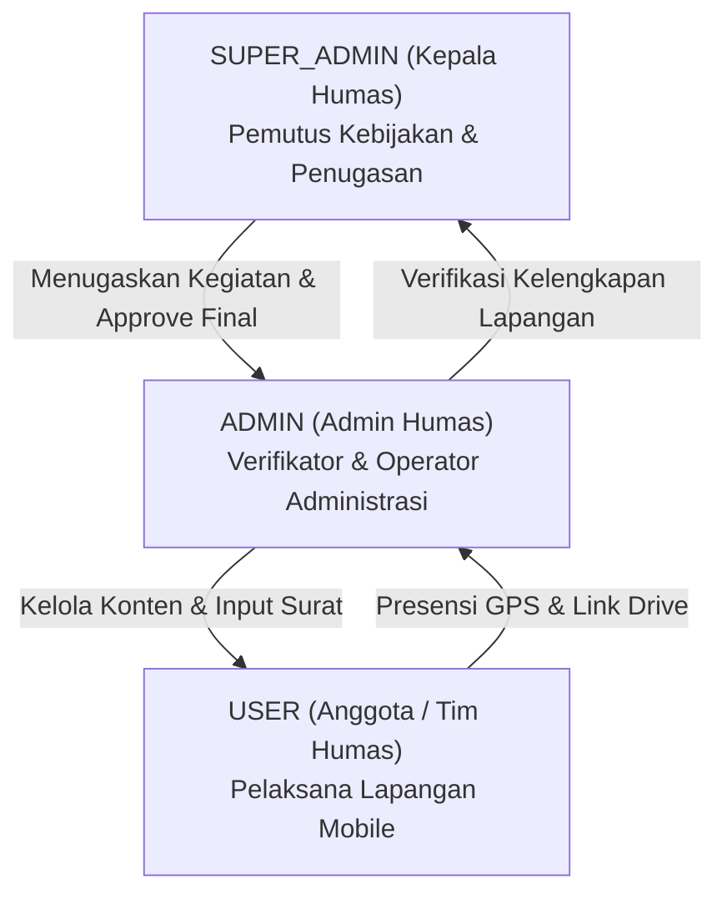

# AUDIT KESESUAIAN PROPOSAL DENGAN IMPLEMENTASI TERKINI
**Sistem Informasi Manajemen Kehumasan Berbasis Web & Mobile (Project-Humas-App)**  
*Unit Hubungan Masyarakat (Humas) Politeknik Negeri Lampung*

---

## 1. Ringkasan Eksekutif

Audit ini disusun untuk memetakan kondisi empiris sistem **Project-Humas-App** berdasarkan penelusuran *source code* terkini (*NestJS Backend*, *Prisma ORM*, *PostgreSQL*, *Next.js 16 App Router Frontend*, dan *Flutter Mobile App*) terhadap dokumen proposal awal yang tercantum di `Penjelasan.md`.

Hasil audit menunjukkan bahwa sistem telah mengalami **evolusi arsitektural dan fungsional yang sangat signifikan**. Proposal awal memosisikan sistem secara sederhana sebagai aplikasi Android monolitik dengan MySQL dan peran umum Admin vs Anggota. Pada implementasi faktual, sistem telah berkembang menjadi **platform terintegrasi multi-tier** (*Enterprise-Grade Hybrid Architecture*) yang memisahkan tata kelola manajerial birokrasi institusional pada platform Web (*Next.js*) dengan pelaksanaan operasional lapangan real-time pada platform Mobile (*Flutter*).

Sistem kini menerapkan hierarki birokrasi 3-tingkat (*Super Admin / Kepala Humas*, *Admin Humas*, dan *User / Anggota Tim Humas*) dengan alur kendali ganda (*Two-Tier Verification & Approval*) pada seluruh siklus hidup persuratan, kegiatan liputan, dan perencanaan konten media sosial.

---

## 2. Kondisi Project Saat Ini

### A. Arsitektur & Tumpukan Teknologi Aktual

| Layer | Proposal Awal (`Penjelasan.md`) | Implementasi Terkini di Source Code | Keterangan Status |
| :--- | :--- | :--- | :--- |
| **Backend Framework** | REST API umum / PHP native / CodeIgniter | **NestJS 11** (TypeScript, Modular Architecture, Dependency Injection) | Berubah Total & Meningkat Signifikan |
| **ORM / Database Engine** | MySQL Relasional | **Prisma ORM** dengan basis data **PostgreSQL** | Berubah (PostgreSQL via Docker/Cloud) |
| **Web Frontend** | Website administratif sederhana | **Next.js 16 (App Router)**, React 19, TypeScript, Tailwind CSS, Lucide Icons | Bertambah (Web Admin Manajerial) |
| **Mobile App** | Android Native (Kotlin/Java) | **Flutter 3 (Dart)** Multiplatform (Android SDK target 34) | Berubah ke Flutter Modern |
| **Penyimpanan Media** | Firebase Storage / Lokal | **Cloudinary Cloud Storage** & link Google Drive terstruktur | Berubah ke Cloudinary API |
| **Peta & Geolocation** | Google Maps API | **OpenStreetMap / Flutter Map (Leaflet)** + Geolocator API Native | Berubah (OpenSource Tile Provider) |
| **Push Notification** | Firebase Cloud Messaging (FCM) | **FCM Service** terintegrasi di Mobile + Database Polling Badges di Web | Sesuai & Diperluas |
| **Autentikasi & Keamanan**| Sesi standar | **JWT (JSON Web Token)**, Role-Based Access Control (RBAC), Device Mock-Location Detector | Ditingkatkan secara ketat |

### B. Kondisi Repositori & Direktori

1. **`backend/`**: Berjalan aktif di port `5000` (`http://localhost:5000/api`). Terdiri dari modul-modul: `auth`, `users`, `activities`, `incoming-letters`, `content-plans`, `equipment-loans`, `schedules`, `live-location`, `dashboard`, `reports`, `notifications`, `prisma`, dan `common`.
2. **`frontend/`**: Berjalan aktif di port `3000` (`http://localhost:3000`). Terdiri dari halaman Next.js App Router: `/dashboard`, `/surat-masuk`, `/kegiatan`, `/verifikasi-kegiatan`, `/persetujuan`, `/content-plan`, `/peminjaman-alat`, `/jadwal-piket`, `/live-location`, `/laporan`, `/pengguna`, `/profil`, dan sub-halaman riwayat.
3. **`mobile/`**: Aplikasi Flutter siap build (`apk`), mengelola autentikasi mobile, daftar penugasan kegiatan, presensi GPS selfie, unggah tautan dokumentasi Google Drive, pengerjaan content plan, live location tracking per 10 detik, dan pusat notifikasi.

---

## 3. Role dan Hak Akses

Sistem mengimplementasikan tiga peran pengguna diskrit yang ditentukan melalui `enum Role { SUPER_ADMIN, ADMIN, USER }` pada basis data Prisma:



### Matriks Rinci Hak Akses Terkini:

| Modul / Fungsi | Super Admin (Kepala Humas) | Admin Humas (Admin) | Anggota / Tim Humas (User) |
| :--- | :--- | :--- | :--- |
| **Dashboard** | Statistik analitis menyeluruh, ringkasan persetujuan menunggu | Statistik operasional harian, ringkasan verifikasi menunggu | Ringkasan agenda pribadi, tugas aktif, notifikasi |
| **Surat Masuk** | Review, Persetujuan/Penolakan, Disposisi Langsung ke Kegiatan | Input surat masuk, edit draf surat, verifikasi kelengkapan surat | Tidak memiliki akses (*Hidden*) |
| **Penugasan Kegiatan** | Menentukan PIC & Anggota Tim, buat kegiatan manual | Input data kegiatan tanpa surat (draf), melihat daftar penugasan | Menerima notifikasi penugasan lapangan |
| **Pelaksanaan Kegiatan** | Monitoring status kegiatan (*Read-only*) | Monitoring status kegiatan & monitoring anggota | Check-in GPS, Selfie presensi, submit Google Drive URL |
| **Verifikasi Kegiatan** | Menerima hasil verifikasi dari Admin Humas | **Memverifikasi kelengkapan** presensi & link Google Drive | Mengirimkan bukti kelengkapan tugas lapangan |
| **Persetujuan Akhir Kegiatan**| **Memberikan status SELESAI / Approve Akhir** atau kembalikan perbaikan | Tidak berhak memberikan status SELESAI (hanya ajukan verifikasi) | Tidak memiliki akses |
| **Content Plan** | Review konten, Persetujuan Akhir, Minta Revisi ke Tim | Buat Content Plan, Verifikasi hasil PIC, Ajukan ke Kepala Humas | Mulai kerja, isi caption/copy, unggah link draf/video |
| **Inventaris & Peminjaman** | Melihat laporan peminjaman & status alat | CRUD Alat, input transaksi peminjaman, proses pengembalian | Melihat alat yang sedang dipinjam atas namanya |
| **Jadwal Piket** | Monitoring jadwal seluruh tim | Membuat jadwal piket, validasi bentrok jadwal, update shift | Melihat jadwal piket pribadi di Web & Mobile |
| **Live Location Tim** | Memantau seluruh koordinat & rute tim di peta | Memantau seluruh koordinat & rute tim di peta | Mengirimkan koordinat via background service GPS |
| **Laporan & Evaluasi** | Cetak/ekspor PDF/Excel Laporan & Nilai Kinerja Anggota | Mengunduh laporan rekapitulasi berkala | Tidak memiliki akses |
| **Manajemen Pengguna** | CRUD Pengguna, atur role & reset password | Melihat profil pengguna | Melihat dan memperbarui profil pribadi |

---

## 4. Daftar Modul dan Fitur

Berikut adalah audit modul fungsional aktual yang telah terpasang di dalam source code:

1. **Modul Autentikasi & RBAC (`/auth`, `/users`)**: Login JWT multi-platform, otentikasi role-based guards, pembaruan avatar, manajemen status akun (`AKTIF`, `NONAKTIF`, `SUSPENDED`).
2. **Modul Surat Masuk (`/surat-masuk`)**: Pencatatan metadata surat, upload berkas scan surat (Cloudinary), penentuan koordinat kegiatan surat, verifikasi administrasi admin, review Kepala Humas.
3. **Modul Penugasan & Pelaksanaan Kegiatan (`/kegiatan`)**: Penjadwalan kegiatan berbasis surat maupun manual, penugasan PIC & Anggota (khusus role USER), validasi waktu otomatis (*AKAN_DATANG*, *SEDANG_BERLANGSUNG*, *MENUNGGU_VERIFIKASI*).
4. **Modul Verifikasi Kelengkapan (`/verifikasi-kegiatan`)**: Halaman khusus Admin Humas dengan dua tab (Tab Kegiatan & Tab Content Plan) dan badge notifikasi merah. Menampilkan detail presensi anggota, selfie, dan link Drive sebelum diajukan ke Kepala Humas.
5. **Modul Persetujuan Kepala Humas (`/persetujuan`)**: Halaman khusus Kepala Humas dengan empat tab (*Persetujuan Surat Masuk*, *Penugasan Tim*, *Persetujuan Akhir Kegiatan*, *Persetujuan Content Plan*) dengan badge notifikasi merah.
6. **Modul Content Plan Media Sosial (`/content-plan`)**: Perencanaan editorial (Instagram, TikTok, YouTube, Website, Facebook), penugasan PIC, integrasi link draf & video, alur review berjenjang.
7. **Modul Peminjaman Peralatan / Inventaris (`/peminjaman-alat`)**: Manajemen stok alat kamera & audio, kalkulasi ketersediaan real-time, pencatatan peminjaman, deteksi keterlambatan otomatis, pencatatan kondisi alat kembali (*Baik*, *Rusak Ringan*, *Rusak Berat*, *Hilang*).
8. **Modul Jadwal Piket (`/jadwal-piket`)**: Penjadwalan shift staf/anggota, deteksi bentrok jadwal (*conflict detection algorithm*), sinkronisasi status waktu real-time.
9. **Modul Live Location Tracking (`/live-location`)**: Pemantauan radar tim berbasis Leaflet OpenStreetMap di web dan background geolocator di mobile dengan interval pembaruan 10 detik.
10. **Modul Laporan & Evaluasi Kinerja (`/laporan`)**: Rekapitulasi kegiatan, content plan, peminjaman alat, serta kalkulasi otomatis Nilai Kinerja Anggota (Formula: 60% Presensi + 25% Dokumentasi + 15% Content Plan).
11. **Modul Notifikasi & Audit Log (`/notifications`, Database AuditLog)**: Notifikasi push FCM ke Android, in-app notification center, badge notifikasi sidebar, dan audit trail pencatatan aktivitas sistem.

---

## 5. Alur Surat Masuk

Alur persuratan terhubung secara langsung dengan modul kegiatan:

```
[EKSTERNAL / INSTANSI PENGIRIM]
       │ (Kirim Surat Fisik / PDF)
       ▼
[ADMIN HUMAS]
       │ 1. Input Metadata Surat, Nomor, Tanggal, Pengirim, Perihal
       │ 2. Upload Berkas Scan Surat (Cloudinary)
       │ 3. Isi Rencana Lokasi Acara, Koordinat Geofence, Tanggal, & Jam Pelaksanaan
       │ 4. Verifikasi Administrasi Surat Masuk
       ▼ (Status: MENUNGGU_PERSETUJUAN_KEPALA_HUMAS)
[KEPALA HUMAS / SUPER ADMIN]
       │ 1. Memeriksa detail surat masuk & urgensi acara di Menu Persetujuan
       ├──► [DITOLAK] ── (Input Alasan Penolakan ──► Notifikasi ke Admin)
       │
       ▼ [DISETUJUI] (Surat berstatus DISETUJUI)
[KEPALA HUMAS / SUPER ADMIN]
       │ Mengonversi Surat menjadi Agenda Kegiatan Resmi ("Buat Kegiatan dari Surat")
       │ Menentukan PIC Lapangan & Anggota Tim Humas
       ▼ (Status Surat: DITUGASKAN, Status Kegiatan: AKAN_DATANG / DITUGASKAN)
[NOTIFIKASI OTOMATIS] ──► Dikirimkan ke Mobile PIC & Anggota Tim yang ditugaskan
```

---

## 6. Alur Persetujuan

Sistem mengadopsi mekanisme **Approval Terpusat (*Centralized Approval Hub*)** bagi Kepala Humas pada rute `/persetujuan` dengan 4 pilar persetujuan:

1. **Persetujuan Surat Masuk**: Kepala Humas menyetujui surat usulan sebelum kegiatan dijadwalkan.
2. **Persetujuan & Penugasan Tim**: Kepala Humas menetapkan formasi tim liputan (1 PIC dan N Anggota).
3. **Persetujuan Akhir Kegiatan**: Kepala Humas memeriksa kelengkapan absensi, foto selfie, link dokumentasi Google Drive, dan status pengembalian alat sebelum menandai kegiatan `SELESAI`.
4. **Persetujuan Content Plan**: Kepala Humas mengesahkan draf konten media sosial (caption, visual, video link) sebelum dipublikasikan ke publik.

---

## 7. Alur Penugasan

Penugasan kegiatan dan konten dilakukan dengan aturan bisnis ketat:

1. **Validasi Role Pelaksana**: PIC dan Anggota yang dipilih **wajib** memiliki akun dengan `Role = USER` (Anggota Tim Humas). Admin atau Super Admin tidak dapat ditugaskan sebagai PIC/Anggota kegiatan lapangan.
2. **Validasi Duplikasi & Rangkap Tugas**: Sistem menolak jika PIC merangkap sebagai Anggota dalam satu kegiatan yang sama, atau jika terdapat ID anggota ganda.
3. **Penetapan PIC Lapangan**: PIC bertanggung jawab mengoordinasikan presensi tim dan memastikan link Google Drive dokumentasi diunggah ke sistem.
4. **Notifikasi Otomatis**: Setiap anggota yang terpilih langsung menerima push notification FCM dan rekaman agenda pada aplikasi mobile mereka.

---

## 8. Alur Kegiatan

Siklus hidup kegiatan lapangan bergerak secara dinamis:

```
[PENUGASAN TIM] ──► Status: AKAN_DATANG
       │
       │ (Waktu server memasuki: Jam Mulai Kegiatan s.d. Jam Selesai)
       ▼
[KEGIATAN DIMULAI] ──► Status: SEDANG_BERLANGSUNG
       │
       ├─► Tim Lapangan melakukan Presensi GPS Check-in + Foto Selfie
       ├─► Tim Lapangan menggunakan Alat Dokumentasi yang Dipinjam
       └─► PIC Lapangan mengunggah Link Google Drive Dokumentasi
       │
       │ (Waktu server melewati: Jam Selesai Kegiatan)
       ▼
[MENUNGGU VERIFIKASI] ──► Status: MENUNGGU_VERIFIKASI
       │
       ▼ (Admin Humas memeriksa di Menu Verifikasi Kelengkapan)
[VERIFIKASI ADMIN]
       │
       ├──► [BELUM LENGKAP] ──► Kembalikan ke Tim Lapangan (Status: DIKEMBALIKAN / PERLU_PERBAIKAN)
       │
       └──► [LENGKAP] ──► Diajukan ke Kepala Humas (Status: MENUNGGU_PERSETUJUAN_AKHIR)
                                      │
                                      ▼ (Kepala Humas memeriksa di Menu Persetujuan)
                             [PERSETUJUAN AKHIR]
                                      │
                                      ├──► [REVISI] ──► Status: DIKEMBALIKAN
                                      │
                                      └──► [DISETUJUI] ──► Status: SELESAI
```

---

## 9. Alur Absensi dan GPS

Fitur presensi kehadiran pada aplikasi Mobile telah diaudit dengan rincian logika:

1. **Penyimpanan Geofence**: Lokasi kegiatan menyimpan titik koordinat `Latitude`, `Longitude`, dan radius toleransi `radius` (default: 100 meter).
2. **Validasi Jarak Haversine**: Perhitungan jarak menggunakan formula *Haversine* pada layer backend dan `Geolocator.distanceBetween` pada layer mobile.
3. **Keamanan Anti-Fake GPS**: Modul `DeviceSecurityService` pada aplikasi mobile memeriksa integritas perangkat (`position.isMocked`) untuk mencegah penggunaan aplikasi Fake GPS / Lokasi Palsu.
4. **Validasi Waktu Presensi**:
   - Anggota **TIDAK DAPAT** melakukan presensi sebelum jam mulai kegiatan (`now < startDateTime`). Sistem akan mengeluarkan pesan penolakan: *"Absensi belum tersedia. Kegiatan baru dimulai pada pukul HH:mm WIB"*.
   - Jika presensi dilakukan setelah jam mulai, sistem tetap mencatat kehadiran namun memberi label status `TERLAMBAT`.
5. **Bukti Kehadiran**: Presensi mewajibkan pengambilan foto kamera depan (*selfie*) secara langsung di tempat dan mencatat timestamp server, koordinat GPS, serta jarak fisik meter dari pusat acara.

---

## 10. Alur Dokumentasi dan Verifikasi

1. **Format Penyimpanan Dokumentasi**: Menggunakan tautan folder terstruktur **Google Drive URL** (tipe media: `application/link`) yang diinput oleh PIC/Anggota melalui aplikasi mobile atau web.
2. **Pembatasan Waktu Unggah**: Tautan dokumentasi hanya dapat diunggah setelah kegiatan resmi dimulai.
3. **Verifikasi Kelengkapan oleh Admin Humas (`/verifikasi-kegiatan`)**:
   - Backend memverifikasi 4 syarat mutlak:
     1. PIC sudah melakukan check-in.
     2. Seluruh anggota yang ditugaskan sudah melakukan check-in.
     3. Link Google Drive dokumentasi sudah diunggah.
     4. Seluruh alat inventaris yang dipinjam untuk kegiatan tersebut telah berstatus `SELESAI` (dikembalikan).
   - Jika salah satu syarat belum terpenuhi, sistem menolak pengajuan verifikasi dengan rincian komponen yang belum lengkap.

---

## 11. Alur Content Plan

Audit menyeluruh modul Content Plan media sosial menghasilkan siklus 8 tahap:

```
1. [ADMIN HUMAS]
   Membuat Content Plan (Judul, Platform, Format Konten, Deadline, PIC).
   Status: DITUGASKAN
       │
       ▼
2. [PIC / ANGGOTA TIM - MOBILE & WEB]
   - Klik "Mulai Kerjakan" (Status: DALAM_PENGERJAAN)
   - Menyusun Copywriting / Caption & Tautan Draf Google Drive / Video
   - Klik "Kirim untuk Review"
   Status: MENUNGGU_VERIFIKASI_ADMIN
       │
       ▼
3. [ADMIN HUMAS - MENU VERIFIKASI KELENGKAPAN]
   - Memeriksa kelayakan caption, visual, dan kesesuaian draf konten
   ├──► Minta Perbaikan Internal (Status: REVISI ──► Notifikasi ke PIC)
   └──► Verifikasi Lengkap (Status: MENUNGGU_PERSETUJUAN_KEPALA_HUMAS)
       │
       ▼
4. [KEPALA HUMAS - MENU PERSETUJUAN]
   - Review strategis konten institusi
   ├──► Minta Revisi (Status: REVISI ──► PIC memperbaiki konten)
   └──► Approve Konten (Status: DISETUJUI)
       │
       ▼
5. [ADMIN / TIM HUMAS]
   - Konten diunggah ke media sosial resmi (Instagram, TikTok, YouTube, dll.)
   - Menandai konten "Sudah Tayang" (Status: PUBLISHED / SELESAI)
```

---

## 12. Alur Mobile App

Aplikasi Flutter `poli_humas` memiliki struktur navigasi:

1. **Splash & Authentication**: Pengecekan token JWT tersimpan, login terenkripsi, penyimpanan sesi via `shared_preferences`.
2. **Home Screen (Beranda)**:
   - Banner sambutan & kartu profil dinamis.
   - Ringkasan statistik tugas pribadi (Kegiatan Aktif, Content Plan, Presensi Menunggu).
   - Jadwal Kegiatan Terdekat & Status Check-in.
   - Shortcut aksi cepat: Scan/Presensi GPS, Tugas Konten, Jadwal Piket, Peta Tim.
3. **Activities Module**:
   - Daftar Kegiatan (Tab Akan Datang & Riwayat Selesai).
   - Detail Kegiatan: Deskripsi, Lokasi, Peta Geofence, Daftar Rekan Tim & Status Kehadiran.
   - Layar Presensi: Kamera Selfie + Peta Radius GPS + Deteksi Fake GPS.
   - Layar Upload Dokumentasi Google Drive.
4. **Content Plan Module**:
   - Daftar tugas konten media sosial yang dibebankan kepada user yang login.
   - Detail konten, kolom pengisian caption/copywriting, input link Google Drive hasil video/desain, dan tombol kirim review.
5. **Live Location Service**:
   - Background location polling yang mengirimkan koordinat latitude/longitude perangkat setiap 10 detik ke endpoint backend `/api/live-location/my-location`.
   - Peta Live Location rekan tim lapangan.
6. **Pusat Notifikasi & Profil**: Menampilkan push notification kegiatan, update status tugas, dan manajemen profil staf.

---

## 13. Status-Status Sistem

### A. Status Kegiatan (`ActivityStatus`)
1. `DRAFT`: Draf awal agenda sebelum diajukan.
2. `MENUNGGU_PERSETUJUAN`: Usulan kegiatan menunggu review pelaksanaan oleh Kepala Humas.
3. `DITOLAK`: Usulan kegiatan ditolak oleh Kepala Humas.
4. `DISETUJUI`: Kegiatan disetujui, siap untuk penugasan personel.
5. `DITUGASKAN`: Tim lapangan dan PIC telah ditetapkan oleh Kepala Humas.
6. `AKAN_DATANG`: Kegiatan terjadwal yang menunggu tibanya tanggal dan jam pelaksanaan.
7. `SEDANG_BERLANGSUNG`: Kegiatan aktif sesuai rentang waktu mulai s.d. selesai.
8. `MENUNGGU_VERIFIKASI`: Waktu kegiatan selesai, menunggu kelengkapan presensi & dokumentasi dari tim lapangan.
9. `MENUNGGU_PERSETUJUAN_AKHIR`: Telah diverifikasi lengkap oleh Admin Humas, menunggu persetujuan akhir Kepala Humas.
10. `DIKEMBALIKAN` / `PERLU_PERBAIKAN`: Berkas dokumentasi atau presensi dikembalikan untuk diperbaiki oleh tim lapangan.
11. `SELESAI`: Kegiatan telah disetujui tuntas oleh Kepala Humas dan diarsipkan.
12. `DIBATALKAN`: Kegiatan dibatalkan karena kondisi darurat/teknis.

### B. Status Content Plan (`ContentStatus`)
1. `DRAFT`: Rencana konten baru dirancang.
2. `DITUGASKAN`: Telah diberikan kepada PIC konten.
3. `DALAM_PENGERJAAN`: PIC telah memulai pembuatan visual/copywriting.
4. `MENUNGGU_VERIFIKASI_ADMIN`: PIC telah mengunggah caption & link draf, menunggu verifikasi Admin Humas.
5. `REVISI`: Konten dikembalikan oleh Admin Humas atau Kepala Humas untuk revisi.
6. `MENUNGGU_PERSETUJUAN_KEPALA_HUMAS`: Telah diverifikasi Admin Humas, menunggu approval Kepala Humas.
7. `DISETUJUI`: Telah disetujui oleh Kepala Humas, siap dijadwalkan posting.
8. `PUBLISHED` / `SELESAI`: Konten telah dipublikasikan di platform media sosial.
9. `DIBATALKAN`: Perencanaan konten dibatalkan.

### C. Status Surat Masuk
1. `BARU` / `DRAFT`: Surat masuk baru diinput ke sistem.
2. `MENUNGGU_VERIFIKASI_ADMIN`: Menunggu verifikasi kelengkapan administrasi oleh Admin Humas.
3. `MENUNGGU_PERSETUJUAN_KEPALA_HUMAS`: Menunggu persetujuan disposisi Kepala Humas.
4. `DISETUJUI`: Surat disetujui oleh Kepala Humas.
5. `DITOLAK`: Surat ditolak oleh Kepala Humas disertai alasan penolakan.
6. `DITUGASKAN`: Surat telah dikonversi menjadi kegiatan lapangan dan personel telah ditugaskan.
7. `SELESAI`: Rangkaian acara dari surat masuk telah tuntas dilaksanakan.

### D. Status Presensi (`CheckInStatus`)
1. `SUCCESS`: Hadir tepat waktu di dalam radius geofence kegiatan.
2. `TERLAMBAT`: Hadir di lokasi geofence tetapi melewati jam mulai kegiatan.
3. `MISSED`: Anggota tidak melakukan presensi sampai kegiatan berakhir.
4. `IZIN`: Anggota memiliki keterangan dispensasi/izin resmi.

### E. Status Peminjaman Alat (`LoanStatus`)
1. `SEDANG_DIPINJAM`: Peralatan sedang dibawa oleh staf peminjam.
2. `TERLAMBAT`: Batas waktu pengembalian terlampaui dan alat belum kembali.
3. `SELESAI`: Seluruh alat telah dikembalikan dan diperiksa fisiknya.

---

## 14. Perbandingan Proposal Lama vs Implementasi Saat Ini

| No | Fitur / Aspek | Proposal Lama (`Penjelasan.md`) | Implementasi Saat Ini (Source Code) | Status | Perlu Update Proposal |
| :---: | :--- | :--- | :--- | :---: | :---: |
| 1 | **Arsitektur Sistem** | Mobile App Android tunggal + API PHP MySQL | Hybrid Multi-Platform: Web Admin (Next.js 16) + Mobile (Flutter 3) + NestJS + PostgreSQL | **BERUBAH** | **YA (Wajib)** |
| 2 | **Struktur Role** | 2 Role sederhana: Admin Humas & Anggota | 3 Role Berjenjang: Super Admin (Kepala Humas), Admin Humas, Tim Humas (User) | **BERUBAH** | **YA (Wajib)** |
| 3 | **Modul Surat Masuk** | Belum ada / tidak dijelaskan rinci | Modul komprehensif: Input surat, upload scan, disposisi langsung menjadi kegiatan lapangan | **BERTAMBAH** | **YA (Wajib)** |
| 4 | **Alur Persetujuan** | Tidak ada alur approval berjenjang | Menu khusus `/persetujuan` untuk Kepala Humas (Surat, Penugasan, Verifikasi Akhir, Konten) | **BERTAMBAH** | **YA (Wajib)** |
| 5 | **Menu Verifikasi** | Belum terdefinisi secara terpisah | Menu khusus `/verifikasi-kegiatan` untuk Admin Humas (Tab Kegiatan & Tab Content Plan) | **BERTAMBAH** | **YA (Wajib)** |
| 6 | **Presensi GPS & Selfie**| GPS Check-in sederhana di Android | Validasi Geofence Haversine + Selfie Kamera Depan + Deteksi Anti-Fake GPS + Validasi Waktu Mulai | **SESUAI (DI-UPGRADE)** | **YA** |
| 7 | **Pengelolaan Dokumentasi**| Penyimpanan link dokumentasi | Integrasi Google Drive URL terstruktur + validasi kelengkapan link sebelum verifikasi | **SESUAI (DI-UPGRADE)** | **YA** |
| 8 | **Content Plan** | Pencatatan rencana konten sederhana | Modul editorial komprehensif dengan alur PIC -> Submit Draf -> Verifikasi Admin -> Approve Kepala Humas -> Publish | **BERUBAH** | **YA (Wajib)** |
| 9 | **Peminjaman Alat** | Pencatatan inventaris sederhana | Manajemen stok dinamis on-the-fly, deteksi otomatis keterlambatan, pencatatan kondisi fisik alat kembali | **SESUAI (DI-UPGRADE)** | **YA** |
| 10 | **Jadwal Piket** | Belum ada | Modul jadwal piket staf dengan algoritma pencegahan jadwal bentrok (*Conflict Detection*) | **BERTAMBAH** | **YA** |
| 11 | **Live Location Tracking**| Pelacakan lokasi anggota di peta | Real-time tracking per 10 detik via Flutter Background Service + Peta Leaflet OpenStreetMap di Web & Mobile | **SESUAI** | **YA (Perjelas Engine)** |
| 12 | **Evaluasi & Laporan** | Laporan statis | Ekspor Laporan Periodik + Perhitungan Otomatis Nilai Kinerja Anggota (Formula Pembobotan) | **BERTAMBAH** | **YA** |
| 13 | **Sistem Notifikasi** | Notifikasi FCM standar | Push Notification FCM ke Mobile + In-App Notification Center + Dynamic Badge Merah di Sidebar Web | **SESUAI (DI-UPGRADE)** | **YA** |

---

## 15. Fitur yang Bertambah

Fitur-fitur berikut **sudah aktif di source code** namun belum tercantum dalam proposal lama:

1. **Modul Pengelolaan Surat Masuk Terpadu**: Kemampuan mengunggah surat dinas eksternal dan mendisposisikannya langsung menjadi agenda kegiatan liputan lapangan tanpa perlu mengetik ulang data.
2. **Pusat Persetujuan Kepala Humas (`/persetujuan`)**: Panel terpusat bagi pimpinan untuk melakukan *review*, persetujuan surat masuk, penugasan tim, persetujuan konten, dan approval akhir kegiatan.
3. **Pusat Verifikasi Kelengkapan Admin Humas (`/verifikasi-kegiatan`)**: Panel kerja khusus bagi Admin Humas untuk mengaudit kehadiran tim dan tautan dokumentasi Google Drive sebelum berkas diserahkan ke Kepala Humas.
4. **Indikator Badge Notifikasi Sidebar**: Tanda titik/angka merah pada menu sidebar Web Admin yang secara otomatis muncul jika terdapat surat/kegiatan/konten yang membutuhkan tindakan verifikasi atau persetujuan.
5. **Modul Jadwal Piket & Algoritma Anti-Bentrok**: Penjadwalan piket kantor harian staf dengan validasi sistem yang menolak pembuatan jadwal apabila staf telah memiliki jadwal tugas lain pada jam yang sama.
6. **Modul Evaluasi Kinerja Anggota Humas**: Penilaian otomatis keaktifan staf humas menggunakan formula matematis terbobot (Presensi 60%, Dokumentasi 25%, Konten 15%) yang disajikan pada modul laporan.
7. **Deteksi Anti-Fake GPS & Validasi Integritas Perangkat**: Pemeriksaan parameter `position.isMocked` pada aplikasi Android untuk menggagalkan kecurangan absensi menggunakan aplikasi manipulasi lokasi.

---

## 16. Fitur yang Berubah

Perubahan logika utama antara proposal lama dengan implementasi saat ini:

1. **Pemisahan Peran Operasional & Manajerial**:
   - *Proposal*: Admin mengelola seluruh kegiatan secara mandiri.
   - *Implementasi*: Terjadi pemisahan kewenangan birokrasi yang jelas. Admin Humas hanya bertindak sebagai verifikator kelengkapan administrasi, sementara hak penugasan tim dan persetujuan akhir mutlak berada di tangan Kepala Humas (*Super Admin*).
2. **Model Penyimpanan Berkas & Media**:
   - *Proposal*: Berkas disimpan pada Firebase Storage atau server lokal.
   - *Implementasi*: Foto/dokumen surat dikelola via **Cloudinary API**, sementara dokumentasi video/foto resolusi tinggi kegiatan disimpan melalui **Google Drive URL** terstruktur guna efisiensi bandwidth server institusi.
3. **Penyedia Peta (*Map Provider*)**:
   - *Proposal*: Bergantung pada Google Maps API berbayar.
   - *Implementasi*: Menggunakan **OpenStreetMap (OSM) / Leaflet / Flutter Map** yang lebih efisien, fleksibel, dan bebas limitasi kuota API komersial.

---

## 17. Fitur yang Belum Selesai / Bermasalah

Status temuan audit teknis berdasarkan inspeksi source code:

1. **FCM Push Notification Mobile Background Handler**:
   - *Kondisi*: Notifikasi FCM telah terintegrasi di tingkat controller backend dan Flutter app. Namun, penanganan pesan saat aplikasi dalam status *Terminated / Killed* masih sangat bergantung pada konfigurasi file `google-services.json` dan kebijakan manajemen baterai OEM Android (beberapa tipe perangkat Android mematikan background service).
   - *Rekomendasi Dokumen*: Cantumkan sebagai "Telah Diimplementasikan dengan ketergantungan pada izin background service perangkat Android".
2. **Live Location Background Battery Consumption**:
   - *Kondisi*: Interval tracking 10 detik berfungsi baik saat aplikasi aktif (*Foreground*), namun konsumsi daya baterai meningkat jika pelacakan dibiarkan berjalan terus-menerus.
   - *Rekomendasi Dokumen*: Jelaskan mekanisme pelacakan diaktifkan saat jam penugasan kegiatan berlangsung.

---

## 18. Fitur yang Tidak Sesuai Proposal

1. **Penggunaan Database MySQL**: Pada proposal lama tertulis basis data MySQL, sedangkan sistem aktual telah menggunakan **PostgreSQL** yang dikelola melalui **Prisma ORM**.
2. **Pengembangan Khusus Android Native**: Pada proposal lama metode implementasi menyebutkan Android Studio (Java/Kotlin), sedangkan sistem aktual dibangun menggunakan framework modern **Flutter (Dart)** yang bersifat *cross-platform*.
3. **Ketiadaan Platform Web Manajerial pada Proposal**: Proposal lama hanya berfokus pada aplikasi Android, padahal sistem kehumasan institusi tidak dapat berjalan tanpa Web Dashboard manajerial yang kini diimplementasikan menggunakan **Next.js 16**.

---

## 19. Deskripsi Sistem Versi Terbaru

*(Dapat langsung digunakan pada Bab I & Bab III Proposal / Skripsi)*

> **Sistem Informasi Manajemen Kehumasan Berbasis Web dan Mobile (Project-Humas-App)** merupakan platform terintegrasi yang dirancang untuk mengotomatisasi dan mengoptimalkan tata kelola operasional, koordinasi penugasan lapangan, pengelolaan aset liputan, serta publikasi media pada Unit Hubungan Masyarakat Politeknik Negeri Lampung. 
>
> Sistem ini menerapkan arsitektur *Client-Server Hybrid* yang menghubungkan **Web Dashboard Manajerial (Next.js 16)** untuk tingkat pimpinan (Kepala Humas) dan staf administrasi (Admin Humas) dengan **Aplikasi Mobile (Flutter 3)** untuk staf pelaksana lapangan (Tim Humas). Komunikasi data dikelola oleh **Backend RESTful API (NestJS)** dengan basis data relasional **PostgreSQL** dan **Prisma ORM**.
>
> Sistem mengadopsi mekanisme kendali berjenjang (*Two-Tier Governance*) yang mencakup:
> 1. **Tata Kelola Persuratan**: Digitalisasi alur surat masuk eksternal hingga konversi langsung menjadi jadwal kegiatan resmi.
> 2. **Manajemen Penugasan Lapangan**: Penunjukan PIC dan pembagian tim berbasis kompetensi oleh Kepala Humas.
> 3. **Presensi Cerdas Berbasis Lokasi**: Validasi kehadiran waktu nyata di lokasi acara menggunakan kalkulasi jarak *Geofencing GPS*, swafoto (*selfie*), validasi jadwal kegiatan, dan proteksi *Anti-Fake GPS*.
> 4. **Verifikasi & Dokumentasi Terstruktur**: Audit bertingkat terhadap presensi personel dan tautan penyimpanan Google Drive sebelum kegiatan disahkan selesai.
> 5. **Manajemen Perencanaan Konten (*Content Plan*)**: Perencanaan editorial multi-platform dengan alur peninjauan draf, supervisi redaksi, dan persetujuan publikasi.
> 6. **Monitoring Tim & Aset**: Pemantauan radar posisi tim di lapangan (*Live Location*) serta pencatatan stok dan sirkulasi peminjaman alat dokumentasi.

---

## 20. Tabel Fitur Final untuk Proposal

| No | Modul | Fitur Utama | Role Pengguna | Platform | Status Implementasi |
| :---: | :--- | :--- | :--- | :---: | :---: |
| 1 | **Autentikasi** | Login JWT, Profile Management, Role Guards | Semua Role | Web + Mobile | IMPLEMENTED |
| 2 | **Dashboard** | Analitik Statistik, Ringkasan Tugas, Action Items | Semua Role (Tampilan Sesuai Role) | Web + Mobile | IMPLEMENTED |
| 3 | **Surat Masuk** | Input Surat, Upload Berkas, Disposisi Kegiatan | Super Admin, Admin | Web | IMPLEMENTED |
| 4 | **Persetujuan Surat** | Approval / Penolakan Surat Masuk | Super Admin | Web | IMPLEMENTED |
| 5 | **Agenda Kegiatan** | Penjadwalan Manual / Surat, Kalender Kegiatan | Super Admin, Admin, User | Web + Mobile | IMPLEMENTED |
| 6 | **Penugasan Tim** | Penunjukan PIC Lapangan & Anggota Liputan | Super Admin | Web | IMPLEMENTED |
| 7 | **Presensi Kehadiran** | Geofence Check-in, Selfie Camera, Time Constraint | User (Tim Humas) | Mobile | IMPLEMENTED |
| 8 | **Anti-Fake GPS** | Deteksi Mock Location Perangkat | User (Tim Humas) | Mobile | IMPLEMENTED |
| 9 | **Dokumentasi** | Upload Tautan Google Drive Terstruktur | User, Admin, Super Admin | Web + Mobile | IMPLEMENTED |
| 10 | **Verifikasi Kegiatan**| Audit Kelengkapan Absensi, Foto, & Link Drive | Admin Humas | Web | IMPLEMENTED |
| 11 | **Approval Akhir** | Pengesahan Kegiatan Selesai / Pengembalian | Super Admin | Web | IMPLEMENTED |
| 12 | **Content Plan** | Perencanaan Editorial Konten Multi-Platform | Admin, Super Admin, User | Web + Mobile | IMPLEMENTED |
| 13 | **Review Konten** | Supervisi Draf, Revisi Caption & Video Link | Admin Humas, Super Admin | Web | IMPLEMENTED |
| 14 | **Approval Konten** | Pengesahan Konten Siap Tayang / Publish | Super Admin, Admin | Web | IMPLEMENTED |
| 15 | **Inventaris Alat** | Manajemen Stok Kamera/Audio & Peminjaman | Admin Humas, Super Admin | Web | IMPLEMENTED |
| 16 | **Pencatatan Kembali**| Audit Kondisi Fisik Alat & Denda/Keterlambatan | Admin Humas | Web | IMPLEMENTED |
| 17 | **Jadwal Piket** | Penjadwalan Shift & Deteksi Jadwal Bentrok | Admin Humas, User | Web + Mobile | IMPLEMENTED |
| 18 | **Live Location** | Radar Pelacakan Posisi Tim Lapangan (10s) | Super Admin, Admin (User kirim koordinat) | Web + Mobile | IMPLEMENTED |
| 19 | **Laporan & Ekspor** | Cetak Rekapitulasi Kegiatan & Aset (PDF/Excel) | Super Admin, Admin | Web | IMPLEMENTED |
| 20 | **Evaluasi Kinerja**| Perhitungan Otomatis Skor Kinerja Anggota | Super Admin, Admin | Web | IMPLEMENTED |
| 21 | **Notifikasi** | Push Notification FCM, Notification Center, Badges| Semua Role | Web + Mobile | IMPLEMENTED |

---

## 21. Alur Bisnis Sistem Versi Terbaru

### A. Alur Bisnis Utama (Persuratan → Penugasan → Kegiatan → Verifikasi → Selesai)

```
[ADMIN HUMAS]
      │
      ├─► Input Surat Masuk + Koordinat Acara + Upload PDF
      │
      ▼ (Status: MENUNGGU_PERSETUJUAN_KEPALA_HUMAS)
[KEPALA HUMAS / SUPER ADMIN]
      │
      ├─► Memeriksa di Menu Persetujuan (Tab Surat Masuk)
      ├─► [SETUJUI SURAT]
      ├─► [BUAT KEGIATAN & TUGASKAN TIM]
      │     (Pilih PIC & Anggota dari Role USER)
      │
      ▼ (Status: DITUGASKAN / AKAN_DATANG)
[TIM HUMAS / USER - MOBILE APP]
      │
      ├─► Menerima Push Notification & Rincian Tugas
      │
      │ (Memasuki Waktu Mulai Acara: Status -> SEDANG_BERLANGSUNG)
      ├─► Tiba di Lokasi -> Buka Menu Check-In
      ├─► Validasi Geofence GPS (< 100m) & Deteksi Anti-Fake GPS
      ├─► Pengambilan Foto Selfie Kamera Depan -> Check-in Berhasil
      ├─► Melaksanakan Tugas Liputan
      ├─► PIC Mengunggah Link Google Drive Dokumentasi
      │
      │ (Waktu Acara Berakhir: Status -> MENUNGGU_VERIFIKASI)
      ▼
[ADMIN HUMAS - WEB ADMIN]
      │
      ├─► Buka Menu "Verifikasi Kelengkapan" (Tab Kegiatan)
      ├─► Memeriksa Kehadiran PIC, Seluruh Anggota, Link Drive, & Pengembalian Alat
      │
      ├──► [TIDAK LENGKAP] ──► Klik "Kembalikan Perbaikan" (Status: DIKEMBALIKAN)
      │
      └──► [LENGKAP] ──► Klik "Verifikasi Lengkap & Ajukan ke Pimpinan"
                                 │
                                 ▼ (Status: MENUNGGU_PERSETUJUAN_AKHIR)
[KEPALA HUMAS / SUPER ADMIN - WEB ADMIN]
      │
      ├─► Buka Menu "Persetujuan" (Tab Persetujuan Akhir)
      ├─► Memeriksa Rekapitulasi Hasil Kegiatan
      │
      ├──► [MINTA REVISI] ──► Status: DIKEMBALIKAN (Tim memperbaiki data)
      │
      └──► [APPROVE SELESAI] ──► Status: SELESAI (Kegiatan Resmi Ditutup & Masuk Laporan)
```

---

## 22. Rekomendasi Update Proposal

Guna menyelaraskan dokumen akademik/proposal proyek dengan realitas implementasi sistem, berikut poin-poin yang harus diperbarui:

1. **Bagian yang Harus Diperbarui**:
   - **Judul & Batasan Masalah**: Perluas cakupan judul atau batasan masalah dari *"Aplikasi Mobile Android"* menjadi *"Sistem Informasi Manajemen Kehumasan Berbasis Web dan Mobile"*.
   - **Tinjauan Pustaka & Teknologi (Bab II & III)**: Ganti penyebutan PHP/MySQL dan Android Native menjadi **NestJS (TypeScript)**, **PostgreSQL (Prisma ORM)**, **Next.js 16 (React)**, dan **Flutter (Dart)**.
   - **Metodologi Pengembangan**: Jelaskan bahwa arsitektur sistem memisahkan *Web-based Operational Portal* untuk staf manajerial dan *Mobile-based Field Application* untuk tim liputan lapangan.
2. **Bagian yang Harus Ditambahkan**:
   - **Use Case Diagram 3 Aktor**: Tambahkan aktor *Super Admin (Kepala Humas)*, *Admin Humas*, dan *User (Anggota Tim Humas)* beserta relasi use case berjenjang.
   - **Modul Surat Masuk**: Masukkan use case input surat dan konversi disposisi surat menjadi agenda kegiatan.
   - **Modul Verifikasi & Persetujuan Berjenjang**: Deskripsikan prosedur *Two-Tier Approval Workflow* pada kegiatan dan content plan.
   - **Modul Jadwal Piket & Evaluasi Kinerja**: Cantumkan fitur penjadwalan piket anti-bentrok serta formula pembobotan skor kinerja staf.
3. **Bagian yang Perlu Dihapus / Disesuaikan**:
   - Hapus klaim penggunaan IDE tunggal Android Studio untuk seluruh sistem.
   - Hapus asumsi bahwa seluruh proses persetujuan dan administrasi dapat diselesaikan hanya melalui layar smartphone Android kecil; jelaskan peran penting Web Admin dalam menunjang tugas administratif yang kompleks.
4. **Catatan Kejujuran Implementasi (Blackbox & UAT)**:
   - Pada bab pengujian (*Testing*), laporkan bahwa pengujian fungsionalitas mencakup validasi presensi GPS, deteksi fake GPS, pembatasan waktu check-in, dan validasi formasi penugasan.

---

## 23. Kesimpulan

Implementasi sistem **Project-Humas-App** yang ada saat ini berada dalam kondisi **jauh lebih matang, lengkap, dan berorientasi institusional** dibandingkan rancangan awal pada `Penjelasan.md`. 

Pengembangan telah berhasil menjawab kebutuhan riil birokrasi kehumasan Politeknik Negeri Lampung melalui pemisahan peran yang tegas antara pembuat kebijakan (*Kepala Humas*), verifikator operasional (*Admin Humas*), dan pelaksana teknis lapangan (*Anggota Tim*). Seluruh modul utama (Surat Masuk, Penugasan Kegiatan, Presensi GPS & Selfie, Verifikasi Kelengkapan, Persetujuan Akhir, Content Plan, Peminjaman Alat, Jadwal Piket, Live Location, Laporan Kinerja, dan Notifikasi FCM) telah terhubung secara fungsional (*end-to-end*) antara Web Dashboard dan Mobile Application.

Dokumen audit ini siap dijadikan rujukan utama dalam memperbarui naskah Proposal Proyek Mandiri / Laporan Tugas Akhir agar selaras dengan fakta implementasi teknis perangkat lunak.
